# ArcGIS Project Setup and Data Manipulation

## 1. Start New Project

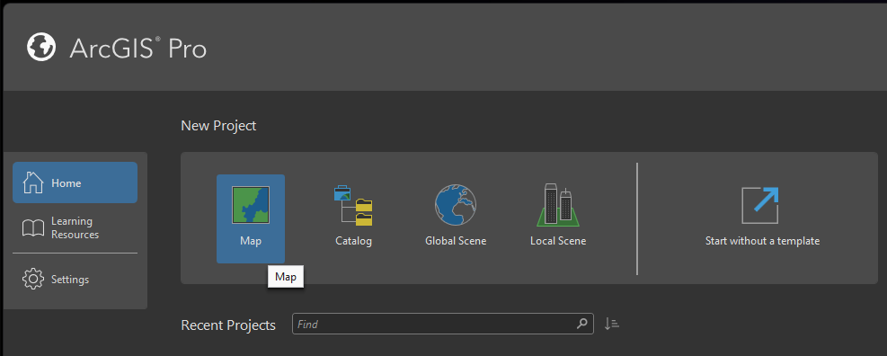

- **Name project**: Assign a unique name for your project.
- **Select save location**: Use the default save location.

## 2. Add Map

- Select **Map** in the ribbon.
- Click on **Add Data**.

  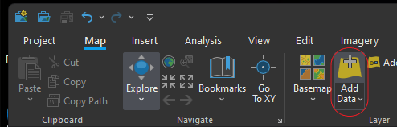

- Navigate to your datasets location, select **MapunitRaster_10m**, and hit **OK**.

  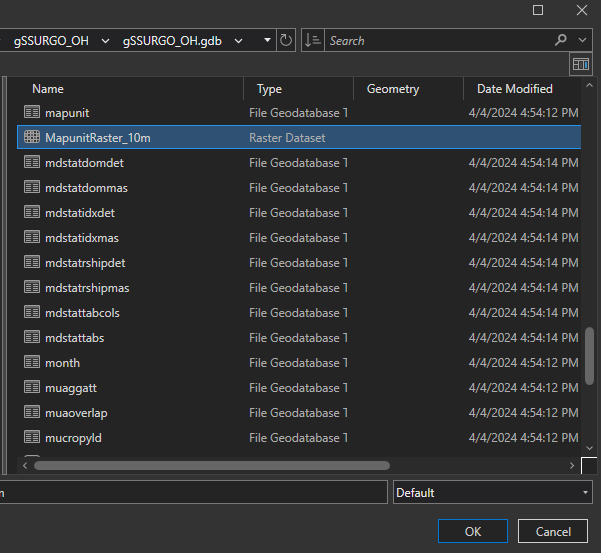

## 3. Accessing the Attribute Table

- Right-click the **MapunitRaster_10m** layer and select **Attribute Table**.

  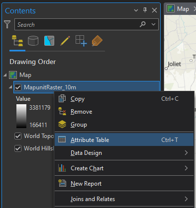

<figure> 
 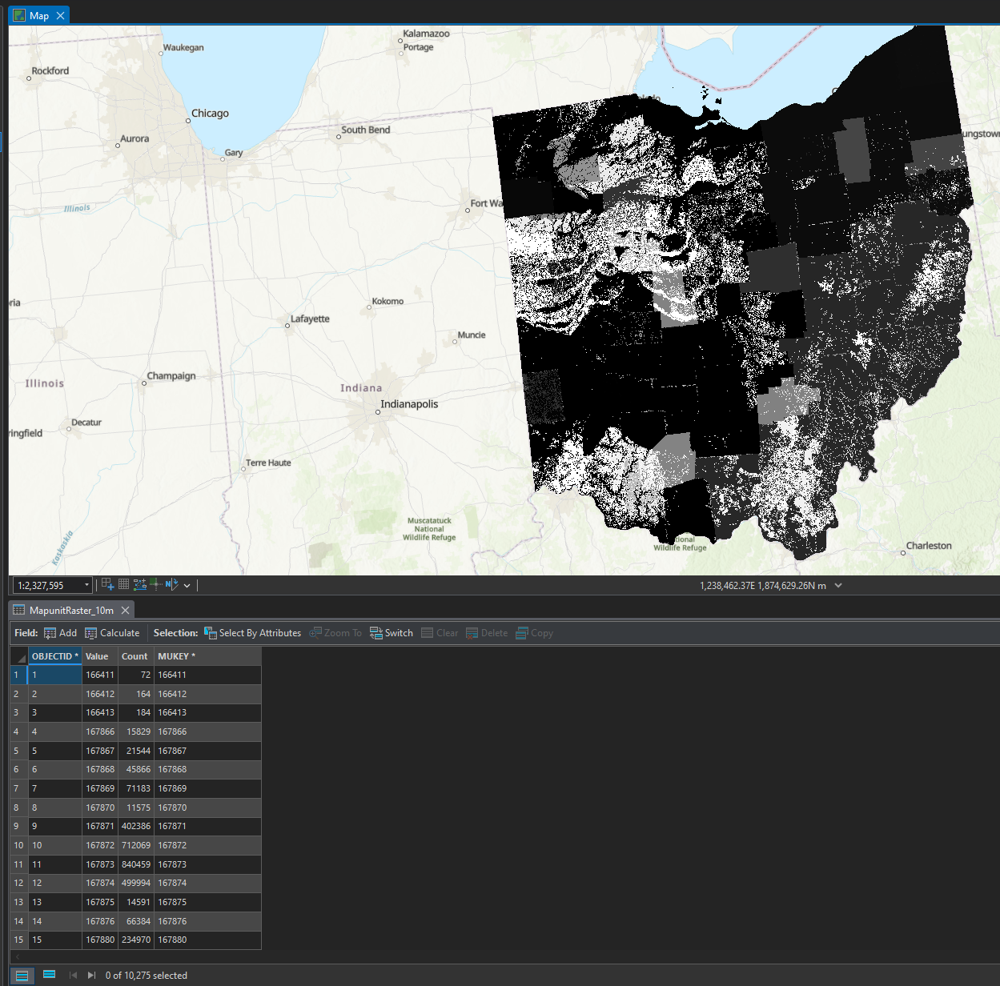
  <figcaption>View of Attribute table</figcaption>
</figure>

- To select all attributes:

  - Click on the **Select by Attribute** icon in the attribute table ribbon.

    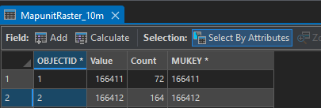

  - A new window will appear allowing you to select specific attributes. The default is to select all, click **OK** to select all attributes in the table.

    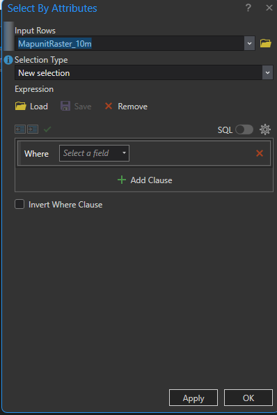

**Note**: For more detailed information on each field in the gSSURGO datasets, refer to the [gSSURGO Look Up Table](/UserGuides/Reference%20Material/gSSURGO%20Look%20Up%20Table%20Column%20Descriptions.pdf).

## 4. Joining Fields From Other Tables

- Click the **Analysis** tab in the ribbon.
- Select **Tools**.

  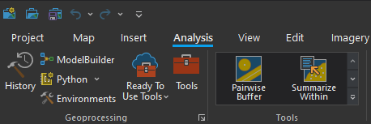

  - The Geoprocessing pane will appear on the right side of the application.

- In the Geoprocessing pane, expand **Data Management Tools**, click **Join Field**.

  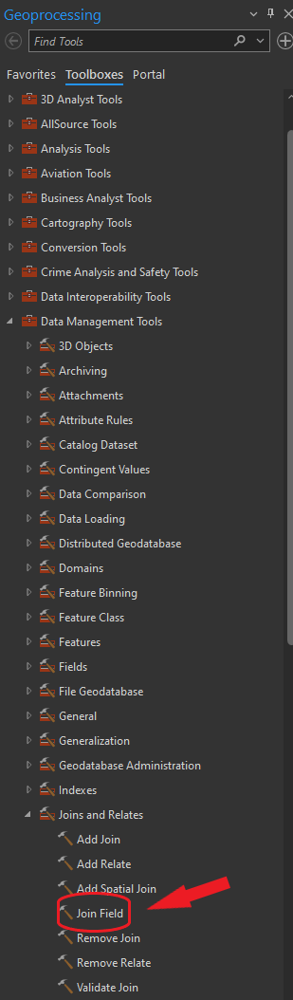

  - Select the **MapunitRaster_10m** layer as the appropriate input table.
  - Select the desired **Input Field**. In this case, **MUKEY**.
  - Click the **Folder** icon to select a **Join Table**. Navigate to the **gSSURGO_OH** folder, open the **gSSURGO_OH.gdb** file, find the **muaggatt** table, select it, and hit **OK**.

    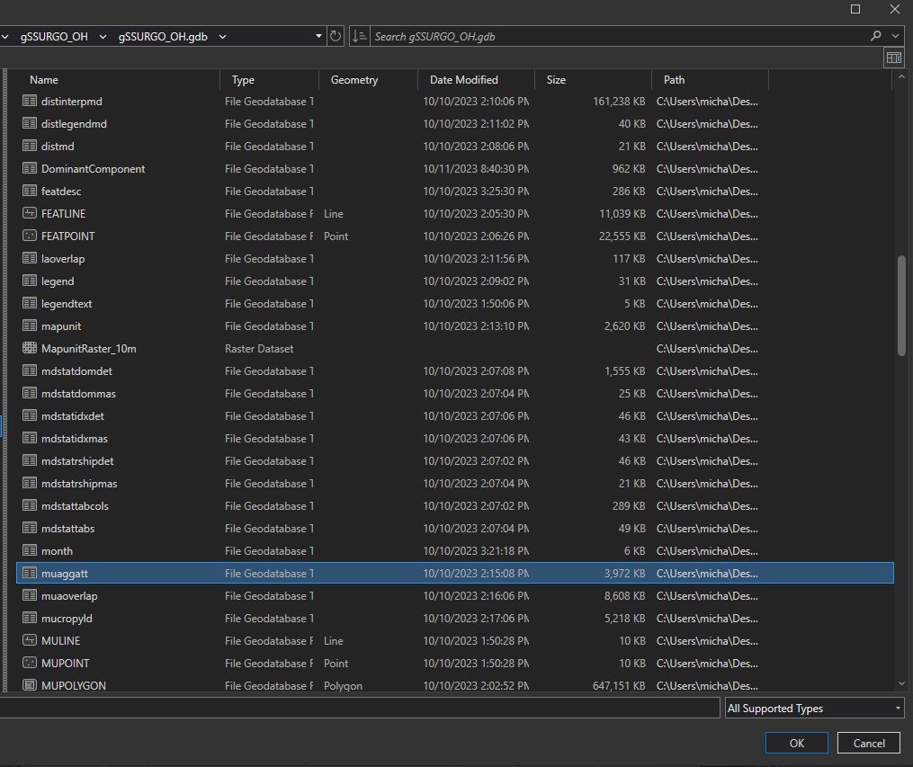

  - In the **Join Field** section, select **Mapunit Key** from the dropdown menu.
  - In the **Transfer Fields** section, choose specific fields to be added: **Mapunit Symbol**, **Mapunit Name**, **Available Water Storage 0-150 cm - Weighted Average**, and **Flooding Frequency - Dominant Condition**.
  - Click **Validate Join** to verify the join can be successfully performed and that records may be joined.

    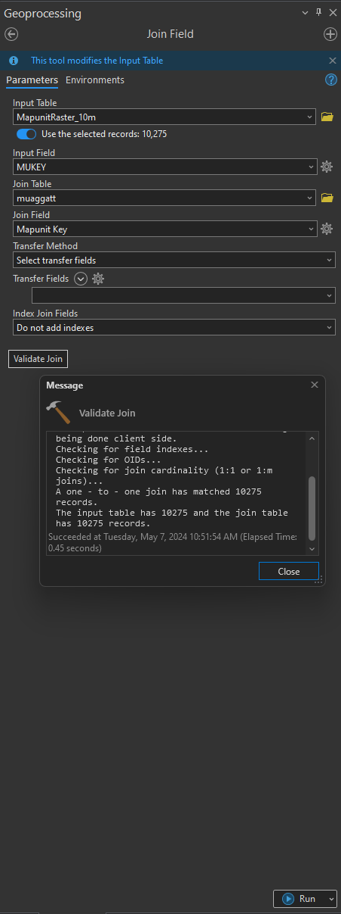

  - Click **Run** to perform the join.

## 5. Symbolize the Data

- In the **Contents Pane** select the **MapunitRaster_10m** layer.
- In the top ribbon, click on **Raster Layer**, then select **Symbology**. A dropdown menu will appear.
- Click on **Unique Values** in the dropdown menu. This will open up a **Symbology Pane** to the right of the application and populate it with the **MUKEY** values.
  - In the **Symbology Pane** under the **Field 1** selection, click the dropdown menu and select the desired field, e.g., **Available Water Storage 0-150 cm - Weighted Average**.
  - To select or customize the color scheme, click on the **Color scheme** dropdown menu and select the desired color specifications.

**Note**: This process may take a while when dealing with large datasets. Each time a color scheme is changed it must repopulate the list using the data, which may take a considerable amount of time.

## Additional Joins

**Note**: When creating additional joins it is recommended to use the [gSSURGO Metadata](/UserGuides/Reference%20Material/gSSURGO%20Metadata%20Table%20Column%20Descriptions%20Report.pdf) to easily identify which fields are shared among the datasets.

- **Join MUPOLYGON table** with **MapunitRaster_10m** using the **MUKEY** and transfer the **AREA SYMBOL** field.
- **Join Legend table** with **MapunitRaster_10m** using the **AREA SYMBOL** field and transfer **Area Name** field.

**Note**: A restart of the map may be required to view the changes to the table.
